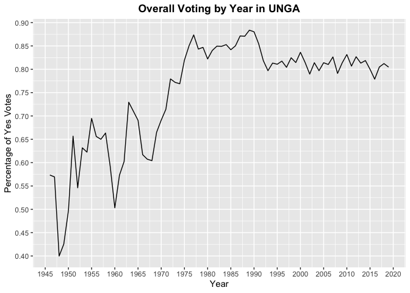
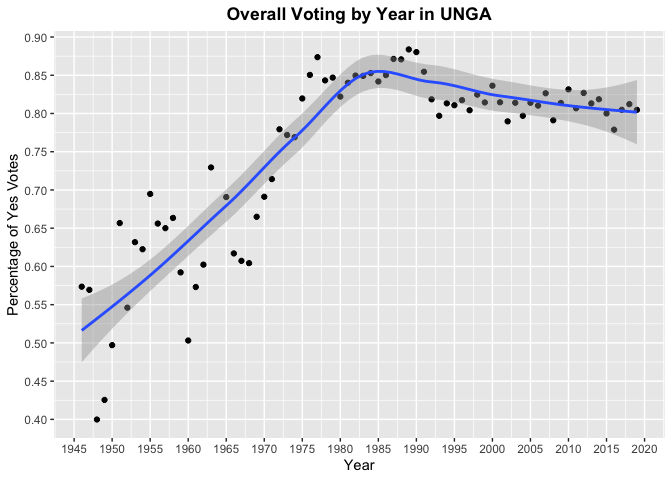
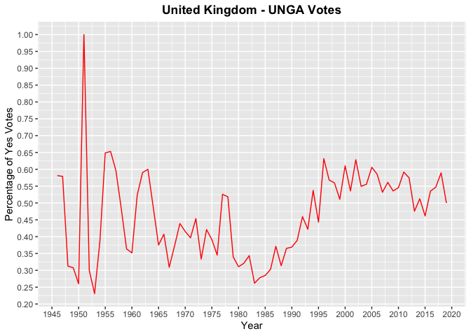
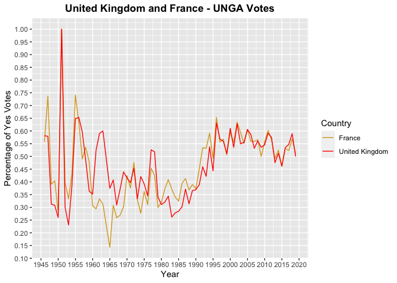
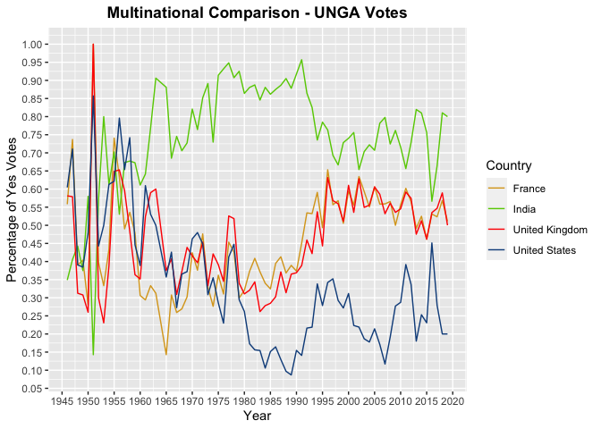
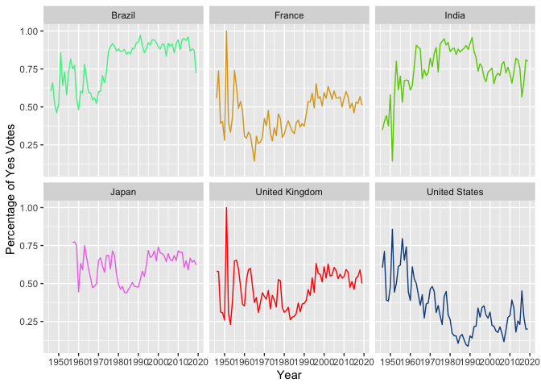
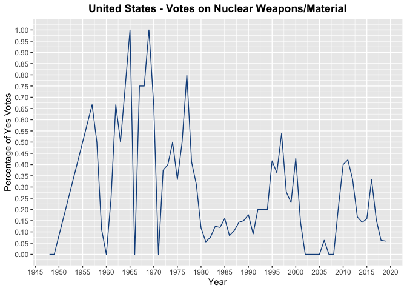
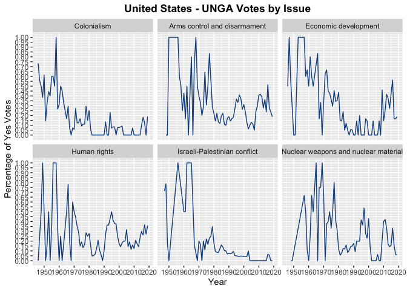
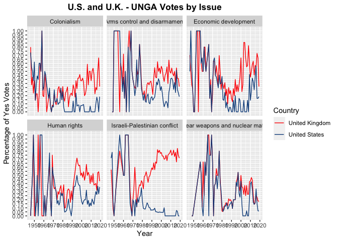
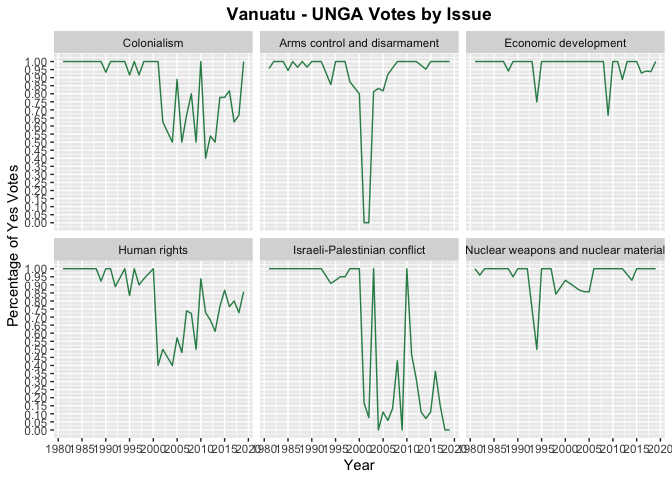

International Consensus: A Look at the Voting History of the United
Nations General Assembly
================

## Introduction

First convened in January 1946, the United Nations General Assembly
(UNGA) functions as the primary forum for crafting policy in the United
Nations. 51 countries were represented at the inaugural meeting; today
(2023) the body comprises 193 member states.

Over the almost eight decades of its existence, the UNGA has deliberated
resolutions concerning a range of topics, from human rights to nuclear
weapons to economic development. With data scientist David Robinson’s R
package `unvotes`, one can gain a better understanding of not only how
the member states have voted over time, but also which issues have—or
have not—garnered international consensus.

### Data Preprocessing

We can see that there are three datasets in the `unvotes` package:
`un_votes`, `un_roll_calls`, and `un_roll_call_issues`.

The first, `un_votes`, contains data regarding each member state’s name
(`country`), country code (`country_code`, such as US for the United
States), roll call ID (`rcid`), and vote (`vote`) for a given
resolution. Votes are categorized as “yes”, “no”, or “abstain”. (States
that were absent during the vote are not included in this dataset.)

    ## # A tibble: 6 × 4
    ##    rcid country            country_code vote 
    ##   <dbl> <chr>              <chr>        <fct>
    ## 1     3 United States      US           yes  
    ## 2     3 Canada             CA           no   
    ## 3     3 Cuba               CU           yes  
    ## 4     3 Haiti              HT           yes  
    ## 5     3 Dominican Republic DO           yes  
    ## 6     3 Mexico             MX           yes

The second dataset, `un_roll_calls`, describes each roll call vote,
including the date (`date`), the resolution being voted on (`unres`),
and a description of said resolution (`descr`). There are also variables
regarding the session number (`session`, with 1 representing 1946),
whether the vote was deemed “important” by the U.S. State Department
(`importantvote`, being either no/0 or yes/1) and if the vote was on an
amendment to a resolution (`amend`) or a paragraph in a resolution
(`para`).

It is important to note that the data spans from the first session
(1946) to the seventy-third session (2019).

    ## # A tibble: 6 × 9
    ##    rcid session importantvote date       unres   amend  para short    descr     
    ##   <int>   <dbl>         <int> <date>     <chr>   <int> <int> <chr>    <chr>     
    ## 1     3       1             0 1946-01-01 R/1/66      1     0 AMENDME… "TO ADOPT…
    ## 2     4       1             0 1946-01-02 R/1/79      0     0 SECURIT… "TO ADOPT…
    ## 3     5       1             0 1946-01-04 R/1/98      0     0 VOTING … "TO ADOPT…
    ## 4     6       1             0 1946-01-04 R/1/107     0     0 DECLARA… "TO ADOPT…
    ## 5     7       1             0 1946-01-02 R/1/295     1     0 GENERAL… "TO ADOPT…
    ## 6     8       1             0 1946-01-05 R/1/297     1     0 ECOSOC … "TO ADOPT…

The final dataset, `un_roll_call_issues`, details the issue to which
each vote pertained. There are a total of six topics for resolutions in
this dataset, namely arms control and disarmament (abbreviated as “di”),
the Israeli-Palestinian conflict (“me”), human rights (“hr”),
colonialism (“co”), nuclear weapons and nuclear material (“nu”), and
economic development (“ec”).

    ## # A tibble: 6 × 3
    ##    rcid short_name issue               
    ##   <int> <chr>      <fct>               
    ## 1    77 me         Palestinian conflict
    ## 2  9001 me         Palestinian conflict
    ## 3  9002 me         Palestinian conflict
    ## 4  9003 me         Palestinian conflict
    ## 5  9004 me         Palestinian conflict
    ## 6  9005 me         Palestinian conflict

The three aforementioned datasets are more or less “clean,” but I wanted
to join `un_votes` and `un_roll_calls` in order to understand more about
each country’s vote. Using `inner_join()` from `dplyr` on the roll call
ID, I created a new tibble called `joined_votes`.

    ## # A tibble: 6 × 12
    ##    rcid country  country_code vote  session importantvote date       unres amend
    ##   <dbl> <chr>    <chr>        <fct>   <dbl>         <int> <date>     <chr> <int>
    ## 1     3 United … US           yes         1             0 1946-01-01 R/1/…     1
    ## 2     3 Canada   CA           no          1             0 1946-01-01 R/1/…     1
    ## 3     3 Cuba     CU           yes         1             0 1946-01-01 R/1/…     1
    ## 4     3 Haiti    HT           yes         1             0 1946-01-01 R/1/…     1
    ## 5     3 Dominic… DO           yes         1             0 1946-01-01 R/1/…     1
    ## 6     3 Mexico   MX           yes         1             0 1946-01-01 R/1/…     1
    ## # … with 3 more variables: para <int>, short <chr>, descr <chr>

Furthermore, I re-coded the `vote` column for easier analysis,
designating “no” as 0, “yes” as 1, and “abstain” as 3.

    ## # A tibble: 6 × 12
    ##    rcid country  country_code  vote session importantvote date       unres amend
    ##   <dbl> <chr>    <chr>        <dbl>   <dbl>         <int> <date>     <chr> <int>
    ## 1     3 United … US               1       1             0 1946-01-01 R/1/…     1
    ## 2     3 Canada   CA               0       1             0 1946-01-01 R/1/…     1
    ## 3     3 Cuba     CU               1       1             0 1946-01-01 R/1/…     1
    ## 4     3 Haiti    HT               1       1             0 1946-01-01 R/1/…     1
    ## 5     3 Dominic… DO               1       1             0 1946-01-01 R/1/…     1
    ## 6     3 Mexico   MX               1       1             0 1946-01-01 R/1/…     1
    ## # … with 3 more variables: para <int>, short <chr>, descr <chr>

Aside from those actions, I chose not to eliminate unnecessary columns
or perform other preprocessing steps at the outset. I believed that it
would be better to combine and streamline the datasets as I conducted my
analysis, performing any “tidying” (mostly for aesthetic purposes) later
on.

## Exploring the Data

### General Findings

We can begin the examination of the data by calculating the total number
of votes from 1946 to 2019 and the percentage of which were “yes”.

The total number of votes cast is 869937, and approximately 79.72% of
those votes were “yes”. The latter value is not very meaningful,
however, as it does not describe when, by whom, or about which issue the
“yes” votes were made.

So, let us summarize the number of total votes and “yes” votes by year.

    ## # A tibble: 73 × 3
    ##     year total percent_yes
    ##    <dbl> <int>       <dbl>
    ##  1  1946  2143       0.573
    ##  2  1947  2039       0.569
    ##  3  1948  3454       0.400
    ##  4  1949  5700       0.425
    ##  5  1950  2911       0.497
    ##  6  1951   402       0.657
    ##  7  1952  4082       0.546
    ##  8  1953  1537       0.632
    ##  9  1954  1788       0.622
    ## 10  1955  2169       0.695
    ## # … with 63 more rows

We can use the data to make a line graph with the `ggplot2` package.

<!-- -->

From the graph, it would seem that the consensus of U.N. member states
has generally risen over time, although there appear to have been sharp
disagreements at certain points. Indeed, the line “dips” around 1948,
for example, which was perhaps related to the creation of the State of
Israel and ensuing conflict. (Interestingly, the most contentious vote
that year seemed to have been on a resolution to adopt Spanish as one of
the working languages of the UNGA \[A/RES/247(III)\], with 32 members in
favor, 20 against, and 5 abstaining). Another “dip” occurs around 1960,
which could have been due to strong opposition to resolutions about
colonial territories (e.g., A/RES/1580(XV)) and the devolving situation
in the Congo (e.g., A/RES/1498(XV)). After the mid-1960’s, `percent_yes`
begins to rise relatively rapidly to 87% in 1977 and hovered between 75%
and 85% in the years that followed.

A scatter plot presents a more nuanced view of the voting trends, with
an added smoothing curve.

<!-- -->

One can also organize the data by country:

    ## # A tibble: 200 × 3
    ##    country           total percent_yes
    ##    <chr>             <int>       <dbl>
    ##  1 Afghanistan        5604       0.853
    ##  2 Albania            4237       0.710
    ##  3 Algeria            5289       0.882
    ##  4 Andorra            2323       0.663
    ##  5 Angola             3739       0.919
    ##  6 Antigua & Barbuda  3344       0.916
    ##  7 Argentina          6132       0.791
    ##  8 Armenia            2361       0.758
    ##  9 Australia          6166       0.562
    ## 10 Austria            5709       0.645
    ## # … with 190 more rows

We can group the data by year and country to see how positively each
member state voted in a given year.

    ## # A tibble: 10,461 × 4
    ## # Groups:   year [73]
    ##     year country     total percent_yes
    ##    <dbl> <chr>       <int>       <dbl>
    ##  1  1946 Afghanistan    17       0.412
    ##  2  1946 Argentina      43       0.698
    ##  3  1946 Australia      43       0.558
    ##  4  1946 Belarus        43       0.442
    ##  5  1946 Belgium        43       0.605
    ##  6  1946 Bolivia        43       0.698
    ##  7  1946 Brazil         43       0.605
    ##  8  1946 Canada         42       0.643
    ##  9  1946 Chile          43       0.605
    ## 10  1946 Colombia       42       0.310
    ## # … with 10,451 more rows

Upon further inspection, we can see that the country with the lowest
overall percentage of “yes” votes (`percent_yes`) is Zanzibar, which
voted “yes” 0 of the time. The country with the highest percentage of
positive votes is Seychelles, and it voted “yes” in approximately 0% of
its 2109 votes.

That being said, Zanzibar has only voted 2 times, so its `percent_yes`
does not signify much.

After filtering out countries that cast less than 100 votes, the country
with the lowest `percent_yes` is the United States (29.41% of 6155
votes).

### Country-Specific Trends

Having examined patterns among all of the UNGA member states, we should
also study individual countries’ attitudes over time. The United Kingdom
is one of the founding members of the Assembly and the U.N. Security
Council, and it featured prominently in debates regarding the
Israeli-Palestinian conflict (having previously governed the region) and
colonialism, among other topics.

    ## # A tibble: 73 × 4
    ## # Groups:   year [73]
    ##     year country        total percent_yes
    ##    <dbl> <chr>          <int>       <dbl>
    ##  1  1946 United Kingdom    43       0.581
    ##  2  1947 United Kingdom    38       0.579
    ##  3  1948 United Kingdom    64       0.312
    ##  4  1949 United Kingdom   104       0.308
    ##  5  1950 United Kingdom    50       0.26 
    ##  6  1951 United Kingdom     7       1    
    ##  7  1952 United Kingdom    70       0.3  
    ##  8  1953 United Kingdom    26       0.231
    ##  9  1954 United Kingdom    31       0.387
    ## 10  1955 United Kingdom    37       0.649
    ## # … with 63 more rows

We can filter the country-specific, annual “yes” vote averages for only
the United Kingdom, and the year-to-year differences are best presented
in the form of a line graph:

<!-- -->

One can observe from the graph that, except for a few brief periods, the
votes by the U.K. did not often average above 60% in favor of U.N.
resolutions. There was a spike to 100% “yes” votes in 1951; but only 7
resolutions were put to a vote that session, and they were largely
procedural in nature.

France is another important player in world politics and was similarly
instrumental in founding the United Nations and its various organs. We
can compare its voting history with that of the U.K.

<!-- -->

The trends of the two states is not dissimilar, although the lines
diverge significantly (by a margin of about 45%) between 1960 and 1965.
That being said, they voted more or less the same from the 1980’s into
the new century.

Let us add in another power player, the United States, and a non-Western
country, such as India, and see how the voting patterns compare:

    ## # A tibble: 292 × 4
    ## # Groups:   year [73]
    ##     year country        total percent_yes
    ##    <dbl> <chr>          <int>       <dbl>
    ##  1  1946 France            43       0.558
    ##  2  1946 India             43       0.349
    ##  3  1946 United Kingdom    43       0.581
    ##  4  1946 United States     43       0.605
    ##  5  1947 France            38       0.737
    ##  6  1947 India             37       0.405
    ##  7  1947 United Kingdom    38       0.579
    ##  8  1947 United States     38       0.711
    ##  9  1948 France            64       0.391
    ## 10  1948 India             61       0.443
    ## # … with 282 more rows

<!-- --> Now the
story begins to get a bit more interesting. After the 1980’s, the U.S.
voted “yes” much less than either the U.K. or France, while India
maintained a significantly higher “yes” average than the other three
countries throughout the entire period.

Finally, we can view the voting records for 6 countries—the U.S., the
U.K., France, Japan, Brazil, and India—over the last seventy years.

    ## # A tibble: 427 × 4
    ## # Groups:   year [73]
    ##     year country        total percent_yes
    ##    <dbl> <chr>          <int>       <dbl>
    ##  1  1946 Brazil            43       0.605
    ##  2  1946 France            43       0.558
    ##  3  1946 India             43       0.349
    ##  4  1946 United Kingdom    43       0.581
    ##  5  1946 United States     43       0.605
    ##  6  1947 Brazil            38       0.658
    ##  7  1947 France            38       0.737
    ##  8  1947 India             37       0.405
    ##  9  1947 United Kingdom    38       0.579
    ## 10  1947 United States     38       0.711
    ## # … with 417 more rows

<!-- -->

Japan appears to have been somewhat more stable than the Western
countries, averaging between 50% and 75% “yes”, broadly speaking.
Brazil, like India, voted “yes” at a much higher rate than the Western
members, particularly after 1970.

That being said, visualizing these trends can only tell us so much, and
so we need to quantify these trends, with the help of linear regression.
We can use the United States as an example.

    ## 
    ## Call:
    ## lm(formula = percent_yes ~ year, data = US_by_year2)
    ## 
    ## Residuals:
    ##      Min       1Q   Median       3Q      Max 
    ## -0.22662 -0.08454 -0.00561  0.07595  0.34314 
    ## 
    ## Coefficients:
    ##               Estimate Std. Error t value Pr(>|t|)    
    ## (Intercept) 11.2399749  1.4105079   7.969 1.91e-11 ***
    ## year        -0.0054977  0.0007113  -7.729 5.33e-11 ***
    ## ---
    ## Signif. codes:  0 '***' 0.001 '**' 0.01 '*' 0.05 '.' 0.1 ' ' 1
    ## 
    ## Residual standard error: 0.13 on 71 degrees of freedom
    ## Multiple R-squared:  0.4569, Adjusted R-squared:  0.4492 
    ## F-statistic: 59.73 on 1 and 71 DF,  p-value: 5.325e-11

Working with `percent_yes` as the dependent variable and `year` as the
independent variable, our model shows that the slope is -0.0055.
Furthermore, the *p*-value is less than 0.05 (*a*), meaning that the
relationship between `percent_yes` and `year` is statistically
significant.

Likewise, we can run a linear regression model for the United Kingdom
and compare the results to those from the U.S. model.

    ## # A tibble: 4 × 5
    ##   term        estimate std.error statistic  p.value
    ##   <chr>          <dbl>     <dbl>     <dbl>    <dbl>
    ## 1 (Intercept) 11.2      1.41          7.97 1.91e-11
    ## 2 year        -0.00550  0.000711     -7.73 5.33e-11
    ## 3 (Intercept) -2.39     1.40         -1.71 9.09e- 2
    ## 4 year         0.00144  0.000704      2.05 4.44e- 2

In relation to the U.S., the U.K. trend line has a slightly positive
slope (0.0014). Although the U.K. *p*-value (0.0444) is greater than
that of the U.S., it is still less than *a* and therefore suggests a
significant relationship between `percent_yes` and `year` for the U.K.

We can go one step further and run linear regression on each country in
the UNGA, after nesting the data by country.

    ## # A tibble: 200 × 2
    ##    country     data               
    ##    <chr>       <list>             
    ##  1 Afghanistan <gropd_df [73 × 3]>
    ##  2 Argentina   <gropd_df [73 × 3]>
    ##  3 Australia   <gropd_df [73 × 3]>
    ##  4 Belarus     <gropd_df [73 × 3]>
    ##  5 Belgium     <gropd_df [73 × 3]>
    ##  6 Bolivia     <gropd_df [73 × 3]>
    ##  7 Brazil      <gropd_df [73 × 3]>
    ##  8 Canada      <gropd_df [73 × 3]>
    ##  9 Chile       <gropd_df [73 × 3]>
    ## 10 Colombia    <gropd_df [73 × 3]>
    ## # … with 190 more rows

    ## # A tibble: 400 × 8
    ##    country     data         model  term    estimate std.error statistic  p.value
    ##    <chr>       <list>       <list> <chr>      <dbl>     <dbl>     <dbl>    <dbl>
    ##  1 Afghanistan <gropd_df [… <lm>   (Inter… -1.29e+1  1.16        -11.1  3.16e-17
    ##  2 Afghanistan <gropd_df [… <lm>   year     6.93e-3  0.000585     11.8  1.81e-18
    ##  3 Argentina   <gropd_df [… <lm>   (Inter… -8.70e+0  1.19         -7.33 2.87e-10
    ##  4 Argentina   <gropd_df [… <lm>   year     4.77e-3  0.000598      7.97 1.89e-11
    ##  5 Australia   <gropd_df [… <lm>   (Inter… -3.53e+0  1.38         -2.56 1.25e- 2
    ##  6 Australia   <gropd_df [… <lm>   year     2.06e-3  0.000695      2.96 4.12e- 3
    ##  7 Belarus     <gropd_df [… <lm>   (Inter… -9.10e+0  1.11         -8.20 7.02e-12
    ##  8 Belarus     <gropd_df [… <lm>   year     4.95e-3  0.000560      8.85 4.42e-13
    ##  9 Belgium     <gropd_df [… <lm>   (Inter… -5.53e+0  1.29         -4.30 5.43e- 5
    ## 10 Belgium     <gropd_df [… <lm>   year     3.06e-3  0.000649      4.70 1.22e- 5
    ## # … with 390 more rows

Having both the intercept and slope terms makes this tibble somewhat
unsightly, and so we can filter only for the slope terms (`year`).

    ## # A tibble: 101 × 9
    ##    country  data    model term  estimate std.error statistic  p.value p.adjusted
    ##    <chr>    <list>  <lis> <chr>    <dbl>     <dbl>     <dbl>    <dbl>      <dbl>
    ##  1 Afghani… <gropd… <lm>  year   0.00693  0.000585     11.8  1.81e-18   3.59e-16
    ##  2 Argenti… <gropd… <lm>  year   0.00477  0.000598      7.97 1.89e-11   3.29e- 9
    ##  3 Belarus  <gropd… <lm>  year   0.00495  0.000560      8.85 4.42e-13   8.23e-11
    ##  4 Belgium  <gropd… <lm>  year   0.00306  0.000649      4.70 1.22e- 5   1.61e- 3
    ##  5 Bolivia  <gropd… <lm>  year   0.00523  0.000669      7.83 3.50e-11   6.05e- 9
    ##  6 Brazil   <gropd… <lm>  year   0.00505  0.000541      9.33 5.81e-14   1.12e-11
    ##  7 Chile    <gropd… <lm>  year   0.00602  0.000483     12.5  1.45e-19   2.88e-17
    ##  8 Colombia <gropd… <lm>  year   0.00537  0.000629      8.53 1.75e-12   3.22e-10
    ##  9 Costa R… <gropd… <lm>  year   0.00551  0.000568      9.69 1.27e-14   2.46e-12
    ## 10 Cuba     <gropd… <lm>  year   0.00382  0.000516      7.40 2.16e-10   3.63e- 8
    ## # … with 91 more rows

The resulting tibble is a bit easier to read. I additionally adjusted
all *p*-values to ensure accuracy and filtered for only ones that are
significant (&lt; *a*).

Now we can determine which countries’ voting records increased or
decreased in terms of `percent_yes` the most sharply.

    ## # A tibble: 101 × 9
    ##    country   data   model term  estimate std.error statistic  p.value p.adjusted
    ##    <chr>     <list> <lis> <chr>    <dbl>     <dbl>     <dbl>    <dbl>      <dbl>
    ##  1 Tuvalu    <grop… <lm>  year   0.0219   0.00461       4.75 1.86e- 4   2.01e- 2
    ##  2 German D… <grop… <lm>  year   0.0195   0.00309       6.30 1.42e- 5   1.84e- 3
    ##  3 Uzbekist… <grop… <lm>  year   0.0126   0.00256       4.92 5.65e- 5   6.78e- 3
    ##  4 Yemen Ar… <grop… <lm>  year   0.0125   0.00117      10.8  1.63e-13   3.10e-11
    ##  5 South Af… <grop… <lm>  year   0.0104   0.000963     10.8  7.03e-15   1.37e-12
    ##  6 Tajikist… <grop… <lm>  year   0.00919  0.00194       4.74 7.38e- 5   8.49e- 3
    ##  7 Malawi    <grop… <lm>  year   0.00915  0.00103       8.84 5.14e-12   9.31e-10
    ##  8 Kyrgyzst… <grop… <lm>  year   0.00874  0.00115       7.62 7.42e- 8   1.15e- 5
    ##  9 Kazakhst… <grop… <lm>  year   0.00845  0.000960      8.81 2.78e- 9   4.45e- 7
    ## 10 Yemen Pe… <grop… <lm>  year   0.00813  0.00195       4.18 4.25e- 4   4.29e- 2
    ## # … with 91 more rows

    ## # A tibble: 101 × 9
    ##    country   data   model term  estimate std.error statistic  p.value p.adjusted
    ##    <chr>     <list> <lis> <chr>    <dbl>     <dbl>     <dbl>    <dbl>      <dbl>
    ##  1 Bosnia &… <grop… <lm>  year  -0.0104   0.00152      -6.83 4.55e- 7   6.74e- 5
    ##  2 Vanuatu   <grop… <lm>  year  -0.00755  0.00191      -3.96 3.40e- 4   3.50e- 2
    ##  3 South Ko… <grop… <lm>  year  -0.00678  0.000787     -8.61 3.16e- 9   5.03e- 7
    ##  4 North Ko… <grop… <lm>  year  -0.00659  0.00143      -4.59 9.04e- 5   1.02e- 2
    ##  5 Israel    <grop… <lm>  year  -0.00621  0.000678     -9.15 1.80e-13   3.40e-11
    ##  6 United S… <grop… <lm>  year  -0.00550  0.000711     -7.73 5.33e-11   9.11e- 9
    ##  7 Zimbabwe  <grop… <lm>  year  -0.00446  0.00110      -4.04 2.50e- 4   2.65e- 2
    ##  8 Trinidad… <grop… <lm>  year   0.00245  0.000635      3.86 3.01e- 4   3.16e- 2
    ##  9 Sweden    <grop… <lm>  year   0.00253  0.000572      4.43 3.36e- 5   4.20e- 3
    ## 10 Luxembou… <grop… <lm>  year   0.00257  0.000679      3.79 3.18e- 4   3.31e- 2
    ## # … with 91 more rows

The Polynesian island of Tuvalu had the sharpest increase in
`percent_yes` over time, whereas Bosnia & Herzegovina showed the
sharpest downturn in `percent_yes`.

### Trends by Issue

Let us turn next to the specific issues being voted upon, using the
`un_roll_call_issues` dataset.

    ## # A tibble: 6 × 2
    ##   issue                                    n
    ##   <fct>                                <int>
    ## 1 Arms control and disarmament          1092
    ## 2 Palestinian conflict                  1061
    ## 3 Human rights                          1015
    ## 4 Colonialism                            957
    ## 5 Nuclear weapons and nuclear material   855
    ## 6 Economic development                   765

U.N. resolutions were most related to arms control and disarmament with
1,092 resolutions, followed by the Israeli-Palestinian conflict with
1,061. Economic development, on the other hand, was the subject of only
765 resolutions.

We can join together our previous working tibble with these labels so
that we can better discern how countries voted on particular issues.

    ## # A tibble: 857,878 × 14
    ##     rcid country country_code  vote session importantvote date       unres amend
    ##    <dbl> <chr>   <chr>        <dbl>   <dbl>         <int> <date>     <chr> <int>
    ##  1     6 United… US               0       1             0 1946-01-04 R/1/…     0
    ##  2     6 Canada  CA               0       1             0 1946-01-04 R/1/…     0
    ##  3     6 Cuba    CU               1       1             0 1946-01-04 R/1/…     0
    ##  4     6 Domini… DO               2       1             0 1946-01-04 R/1/…     0
    ##  5     6 Mexico  MX               1       1             0 1946-01-04 R/1/…     0
    ##  6     6 Guatem… GT               0       1             0 1946-01-04 R/1/…     0
    ##  7     6 Hondur… HN               1       1             0 1946-01-04 R/1/…     0
    ##  8     6 El Sal… SV               2       1             0 1946-01-04 R/1/…     0
    ##  9     6 Nicara… NI               1       1             0 1946-01-04 R/1/…     0
    ## 10     6 Panama  PA               2       1             0 1946-01-04 R/1/…     0
    ## # … with 857,868 more rows, and 5 more variables: para <int>, short <chr>,
    ## #   descr <chr>, short_name <chr>, issue <fct>

Having spent a good deal of time exploring the data, I felt that at this
point I could eliminate unneccessary columns and create, reorder, or
rename a few others.

    ## # A tibble: 857,878 × 8
    ##     rcid session  year country             vote unres   issue_abrv issue       
    ##    <dbl>   <dbl> <dbl> <chr>              <dbl> <chr>   <chr>      <fct>       
    ##  1     6       1  1946 United States          0 R/1/107 hr         Human rights
    ##  2     6       1  1946 Canada                 0 R/1/107 hr         Human rights
    ##  3     6       1  1946 Cuba                   1 R/1/107 hr         Human rights
    ##  4     6       1  1946 Dominican Republic     2 R/1/107 hr         Human rights
    ##  5     6       1  1946 Mexico                 1 R/1/107 hr         Human rights
    ##  6     6       1  1946 Guatemala              0 R/1/107 hr         Human rights
    ##  7     6       1  1946 Honduras               1 R/1/107 hr         Human rights
    ##  8     6       1  1946 El Salvador            2 R/1/107 hr         Human rights
    ##  9     6       1  1946 Nicaragua              1 R/1/107 hr         Human rights
    ## 10     6       1  1946 Panama                 2 R/1/107 hr         Human rights
    ## # … with 857,868 more rows

One of the added columns is `issue_abrv`, which contains an abbreviation
of the topic at hand for a given resolution. For instance, we can filter
for “nu” to show only votes that pertained to nuclear weapons and
nuclear material.

    ## # A tibble: 133,635 × 8
    ##     rcid session  year country             vote unres    issue_abrv issue       
    ##    <dbl>   <dbl> <dbl> <chr>              <dbl> <chr>    <chr>      <fct>       
    ##  1    94       3  1948 United States          0 R/3/564A nu         Nuclear wea…
    ##  2    94       3  1948 Canada                 0 R/3/564A nu         Nuclear wea…
    ##  3    94       3  1948 Cuba                   0 R/3/564A nu         Nuclear wea…
    ##  4    94       3  1948 Haiti                  0 R/3/564A nu         Nuclear wea…
    ##  5    94       3  1948 Dominican Republic     0 R/3/564A nu         Nuclear wea…
    ##  6    94       3  1948 Mexico                 0 R/3/564A nu         Nuclear wea…
    ##  7    94       3  1948 Honduras               0 R/3/564A nu         Nuclear wea…
    ##  8    94       3  1948 El Salvador            0 R/3/564A nu         Nuclear wea…
    ##  9    94       3  1948 Nicaragua              0 R/3/564A nu         Nuclear wea…
    ## 10    94       3  1948 Panama                 0 R/3/564A nu         Nuclear wea…
    ## # … with 133,625 more rows

Moreover, we can filter for only the United States’ votes on nuclear
weapons and graph them over time.

<!-- -->

The line appears fairly chaotic, although votes after 1975 were
generally less favorable than during the previous decades.

We can group each country’s votes by both year and issue.

    ## # A tibble: 59,683 × 5
    ##    country      year issue                        total percent_yes
    ##    <chr>       <dbl> <fct>                        <int>       <dbl>
    ##  1 Afghanistan  1946 Colonialism                      5       0.2  
    ##  2 Afghanistan  1946 Economic development             6       0.333
    ##  3 Afghanistan  1946 Human rights                     1       0    
    ##  4 Afghanistan  1947 Colonialism                      8       0.5  
    ##  5 Afghanistan  1947 Economic development             2       0.5  
    ##  6 Afghanistan  1947 Israeli-Palestinian conflict     7       0.143
    ##  7 Afghanistan  1948 Colonialism                     13       0.923
    ##  8 Afghanistan  1948 Arms control and disarmament     9       0    
    ##  9 Afghanistan  1948 Economic development             9       0.222
    ## 10 Afghanistan  1948 Human rights                    10       0.1  
    ## # … with 59,673 more rows

There is not much sense in graphing every country’s voting history on
each issue, but we can examine individual member states, such as the
U.S.

<!-- -->

It seems that, on the whole, the U.S. has voted “yes” less on all six
issues after 1975. How does the United Kingdom, our partner in the
“Special Relationship”, fare?

<!-- -->

While the U.K. also voted “yes” less after the 1970’s, it was
nevertheless more positive than the U.S., especially regarding the
Israeli-Palestinian conflict.

Just as we did for each country’s overall percentage of “yes” votes, we
can fit a linear regression model for each country’s votes by issue over
time.

    ## # A tibble: 254 × 10
    ##    country     issue     data   model term  estimate std.error statistic p.value
    ##    <chr>       <fct>     <list> <lis> <chr>    <dbl>     <dbl>     <dbl>   <dbl>
    ##  1 Afghanistan Colonial… <tibb… <lm>  year   0.00572  0.000824      6.94 1.48e-9
    ##  2 Afghanistan Economic… <tibb… <lm>  year   0.00775  0.00113       6.87 2.12e-9
    ##  3 Afghanistan Israeli-… <tibb… <lm>  year   0.00500  0.00108       4.65 1.85e-5
    ##  4 Afghanistan Arms con… <tibb… <lm>  year   0.00634  0.00124       5.12 2.90e-6
    ##  5 Afghanistan Nuclear … <tibb… <lm>  year   0.00720  0.00130       5.55 6.74e-7
    ##  6 Albania     Human ri… <tibb… <lm>  year  -0.00797  0.00175      -4.54 2.93e-5
    ##  7 Algeria     Nuclear … <tibb… <lm>  year   0.00694  0.00120       5.78 3.69e-7
    ##  8 Andorra     Human ri… <tibb… <lm>  year  -0.00893  0.00171      -5.23 2.33e-5
    ##  9 Angola      Nuclear … <tibb… <lm>  year   0.00406  0.000844      4.81 2.55e-5
    ## 10 Argentina   Economic… <tibb… <lm>  year   0.00601  0.00130       4.61 1.77e-5
    ## # … with 244 more rows, and 1 more variable: p.adjusted <dbl>

Armed with this information, we can answer questions such as: Which
country showed the steepest downward trend in `percent_yes`?

    ## # A tibble: 254 × 10
    ##    country   issue      data    model term  estimate std.error statistic p.value
    ##    <chr>     <fct>      <list>  <lis> <chr>    <dbl>     <dbl>     <dbl>   <dbl>
    ##  1 Vanuatu   Israeli-P… <tibbl… <lm>  year  -0.0298    0.00380     -7.84 3.25e-9
    ##  2 North Ko… Nuclear w… <tibbl… <lm>  year  -0.0193    0.00303     -6.36 8.29e-7
    ##  3 Bosnia &… Human rig… <tibbl… <lm>  year  -0.0189    0.00257     -7.36 1.34e-7
    ##  4 Marshall… Israeli-P… <tibbl… <lm>  year  -0.0161    0.00254     -6.34 8.72e-7
    ##  5 South Ko… Human rig… <tibbl… <lm>  year  -0.0152    0.00175     -8.66 2.82e-9
    ##  6 North Ko… Arms cont… <tibbl… <lm>  year  -0.0144    0.00239     -6.04 1.91e-6
    ##  7 North Ko… Economic … <tibbl… <lm>  year  -0.0137    0.00192     -7.14 1.11e-7
    ##  8 Cameroon  Israeli-P… <tibbl… <lm>  year  -0.0130    0.00279     -4.65 2.16e-5
    ##  9 Vanuatu   Coloniali… <tibbl… <lm>  year  -0.0109    0.00222     -4.89 2.37e-5
    ## 10 Andorra   Human rig… <tibbl… <lm>  year  -0.00893   0.00171     -5.23 2.33e-5
    ## # … with 244 more rows, and 1 more variable: p.adjusted <dbl>

With a slope of -0.0298, Vanuatu has the most drastic negative trend of
the UNGA member states for `percent_yes`.

As before, we can graph Vanuatu’s voting patterns by issue.

<!-- -->

Granted, the island nation has only been a member of the United Nations
since 1981, but certain trends are clear from the graphs: On the one
hand, it seems that Vanuatu has voted very positively during its tenure
in the UNGA. On the other hand, its record is interrupted by dramatic
dips, particularly after the year 2000 and regarding the
Israeli-Palestinian conflict. Vanuatu recognized the State of Palestine
in 1989 and established diplomatic relations that same year. However, in
2011, Vanuatu’s representatives made what appears to be an about-face,
opposing Palestine’s UNESCO application along with fourteen other member
states. In short, the country’s attitudes on the issue are as chaotic as
the graph suggests.

## Conclusion

The United Nations General Assembly is unique, in that it was created to
provide an equal forum for all countries to present their views on major
issues. Using David Robinson’s `unvotes` datasets, we have examined when
and how member states have voted on various issues and considered
reasons as to why they might have voted the way that they did. These
datasets have stories to tell, and those stories are wrapped up in the
story of humanity over the past century.

In the future, I hope to revisit this project and experiment with how
machine learning could be used to predict countries’ voting patterns in
the future.

## Credits

This project was inspired by David Robinson’s DataCamp course entitled
“Case Study: Exploratory Data Analysis in R,” which used abridged (and
slightly different) versions of the datasets in `unvotes`.
